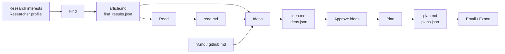
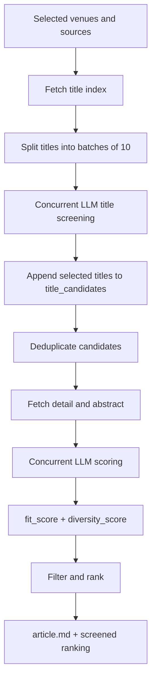
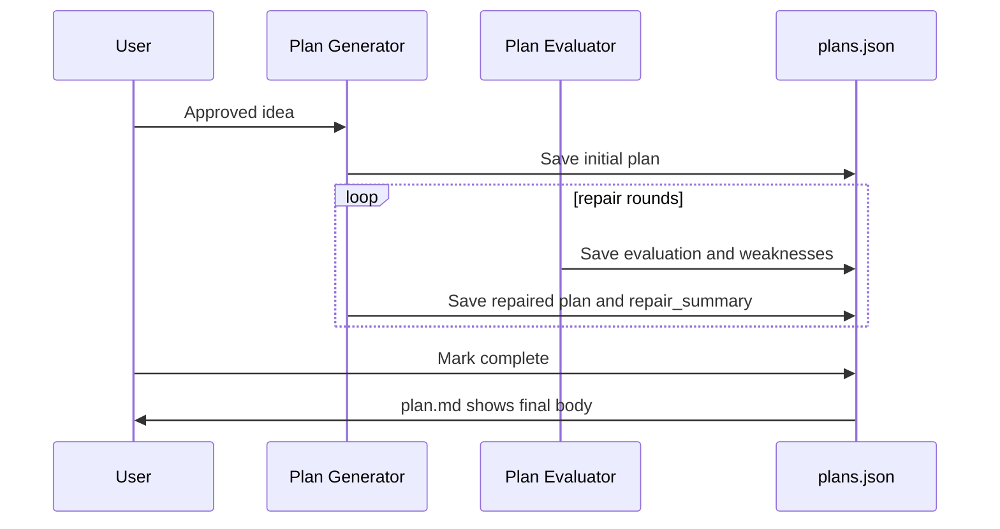

# TASTE: Targeted Academic Search, Triage & Exploration


**TASTE** is a local AI research copilot for discovering papers, triaging them against your research profile, reading selected work deeply, generating research ideas, and turning approved ideas into research plans.

[中文 README](README.md)

Default local URL:

```text
http://127.0.0.1:8765
```

## Table of Contents

- [Highlights](#highlights)
- [Quick Start](#quick-start)
- [Configuration Guide](#configuration-guide)
- [Usage](#usage)
- [Pipeline](#pipeline)
- [Artifacts](#artifacts)
- [Development](#development)
- [Security](#security)
- [Acknowledgements](#acknowledgements)
- [License](#license)

## Highlights

- **Targeted discovery** with a packaged full CCF venue/journal catalog plus ICLR, OpenReview, DBLP, arXiv, bioRxiv, Hugging Face, and GitHub.
- **Strict two-stage triage**: title screening first, then abstract/detail scoring with `fit_score`, `diversity_score`, and final ranking.
- **Research workflow**: Find -> Read -> Ideas -> Plan -> Email/export.
- **Role-specific LLMs** for Find, Read, Idea Generator, Idea Judge, Plan Generator, and Plan Evaluator.
- **Local-first artifacts**: every run is saved as Markdown/JSON on your machine.
- **Safe open-source defaults**: no bundled API keys, private profiles, run history, PDFs, or private reference repositories.

## Quick Start

### Windows

```powershell
git clone <your-fork-or-repo-url> TASTE
cd TASTE
.\scripts\setup_windows.ps1
.\scripts\start_web.ps1
```

Open:

```text
http://127.0.0.1:8765
```

Health check:

```powershell
Invoke-RestMethod http://127.0.0.1:8765/health
```

### Linux

```bash
git clone <your-fork-or-repo-url> TASTE
cd TASTE
bash scripts/setup_linux.sh
bash scripts/start_web.sh
```

### Manual Backend Start

Windows:

```powershell
.\.venv\Scripts\python.exe -m uvicorn auto_research.web.server:app --host 127.0.0.1 --port 8765
```

Linux:

```bash
.venv/bin/python -m uvicorn auto_research.web.server:app --host 127.0.0.1 --port 8765
```

## Configuration Guide

TASTE stores local settings in:

```text
auto_research/.config.json
```

This file is ignored by Git. Start from the safe example:

```powershell
Copy-Item auto_research\.config.example.json auto_research\.config.json
```

Linux:

```bash
cp auto_research/.config.example.json auto_research/.config.json
```

You can also configure everything in the web UI and click **Save Config**.

### Research Profile

| Field | Purpose |
| --- | --- |
| `research_interest` | Current topics you want to track, such as AI for Science, materials discovery, multimodal reasoning, or generative models. |
| `researcher_profile` | Your background, preferred methods, available resources, constraints, and topics to avoid. |

Be specific. TASTE works best when the profile defines what counts as a real match and what should be filtered out as merely broad AI relevance.

### LLM

TASTE uses an OpenAI-compatible Chat Completions API.

| Field | Purpose |
| --- | --- |
| `provider` | Display label, for example `openai`, `deepseek`, or `local`. |
| `base_url` | API base URL, for example `https://api.openai.com/v1`. |
| `api_key` | Your local API key. Keep it out of Git. |
| `model` | Model name. |
| `temperature` | Sampling temperature. `0.2-0.6` is a good starting range. |

Role-specific overrides are available for `find`, `read`, `idea_generator`, `idea_judge`, `plan_generator`, and `plan_evaluator`. Empty role fields inherit the global LLM settings.

### Limits and Sources

| Field | Purpose |
| --- | --- |
| `llm_concurrency` | Find-stage LLM concurrency. Recommended `4-16`; max `32`. |
| `idea_parallel_workers` | Idea generation workers. Recommended `1-8`. |
| `max_fetch_papers` | Maximum number of papers to fetch. |
| `max_recommended_papers` | Maximum final recommended papers. |
| `max_ideas` | Maximum final ideas. |
| `venue_title_scan_limit` | Number of venue titles to scan before LLM triage. |
| `arxiv_categories` | Multiple categories are supported, such as `cs.AI, cs.CV, cs.CL`. |
| `arxiv_start_date`, `arxiv_end_date` | Optional date range. Empty means latest/default feed behavior. |
| `biorxiv_categories` | Multiple bioRxiv subject categories are supported, such as `bioinformatics, neuroscience`; use `all` to skip category filtering. |
| `biorxiv_start_date`, `biorxiv_end_date` | Optional date range. Empty means the latest 30 days. |

### Email Reports

TASTE can send rendered HTML email reports.

| Field | Purpose |
| --- | --- |
| `smtp_server` | SMTP server. |
| `smtp_port` | `465` uses SSL; other ports try STARTTLS. |
| `sender` | Sender email address. |
| `receivers` | Recipient list. |
| `smtp_password` | Local SMTP password or app password. Keep it out of Git. |
| `auto_send_enabled` | Optional automatic send after selected stages. Disabled by default. |

## Usage

### 1. Find

1. Fill in your research interest and researcher profile.
2. Search and add venues from the available venue list.
3. Enter one or more years, for example `2024, 2025, 2026`.
4. Choose whether to include arXiv, bioRxiv, Hugging Face, and GitHub.
5. Start Find and watch the job progress panel.

Find uses a strict append-style pipeline:

```text
venues/arXiv/bioRxiv/HF/GitHub
-> title index
-> LLM title batches of 10
-> appended title_candidates
-> detail and abstract fetch only for candidates
-> LLM abstract scoring
-> ranked recommendations
```

Final recommendations require strong profile fit. Broadly relevant AI papers should receive low `fit_score` unless they clearly match the profile.

### 2. Read

Select papers from `article.md`, download public PDFs where available, and generate `read.md` with an LLM-assisted deep read. TASTE does not bypass paywalls.

### 3. Ideas

Generate candidate research ideas from `article.md`, `read.md`, `hf.md`, and `github.md`. A judge LLM scores and selects final ideas. You can edit, approve, or delete each idea.

### 4. Plan

Generate research plans from approved ideas:

```text
initial plan -> evaluate -> repair/polish -> evaluate -> repair/polish ...
```

Every repair round records evaluation, weaknesses, repair instructions, and repair summary. When marked complete, `plan.md` shows the final body while `plans.json` preserves the full history.

### 5. Email

Configure SMTP, then manually send a run report or enable automatic sending after selected stages. Email content is rendered HTML.

## Pipeline



### Find Triage



### Plan Repair Loop



## Artifacts

Each run is saved under:

```text
auto_research/runs/{run_id}/
```

Common artifacts:

```text
article.md
find_results.json
source_status.md
hf.md
github.md
read.md
read_results.json
idea.md
ideas.json
plan.md
plans.json
config.json
selection.json
manifest.json
email_report.json
```

Generated artifacts may contain private research context. Do not commit them.

## Development

Run tests:

```bash
python -m pytest
```

Build frontend:

```bash
cd auto_research/web/client
npm run build
```

Smoke test API:

```bash
python scripts/smoke_api.py
```

## Security

- TASTE defaults to `127.0.0.1`.
- Do not commit `auto_research/.config.json`.
- Do not commit API keys, SMTP passwords, private researcher profiles, PDFs, or run artifacts.
- Run artifacts redact API keys and SMTP passwords, but may still contain private research context.
- TASTE only downloads publicly accessible PDFs and does not bypass paywalls.

## Acknowledgements

This project was built with reference to several open-source and local prototype repositories during design and implementation. In particular:

- **iDeer**: inspired parts of the research-assistant workflow, source aggregation ideas, report generation patterns, and email-report design.
- **openccf**: informed the CCF venue catalog design and DBLP-oriented crawling strategy; the packaged `auto_research/data/ccf_venues.json` is a normalized venue catalog derived from public openccf CCF data.
- **ICLR2026-Guide-CN**: informed early OpenReview/ICLR paper collection and display ideas.
- **ccf-deadlines**: provided reference ideas for conference metadata organization and user-facing venue workflows.

The `reference_repo/` directory is intentionally **not included** in this open-source release. Please consult the original upstream repositories and their licenses if you reuse those projects directly.

## License

TASTE is licensed under the GNU Affero General Public License v3.0. See [LICENSE](LICENSE).
