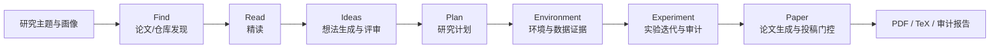
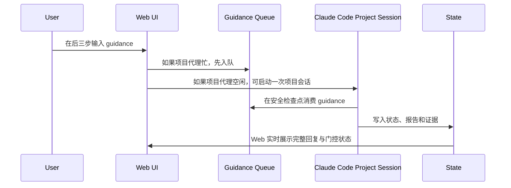

# TASTE: 自动科研工作流与本地研究代理


**TASTE** 是一个本地优先的自动科研系统。它在论文发现、精读、idea、plan 流水线之上，加入项目级自动科研闭环：自动选择研究路线，审计可复现实验环境，调用 Claude Code/Codex 等项目代理执行代码与实验，记录证据链，并在满足证据门控后生成和修订论文。

本仓库只包含框架代码、模板、网页和测试。真实研究项目目录 `projects/*` 默认被 Git 忽略，因为其中可能包含 API 配置、下载的仓库、数据集、实验日志、生成论文和未公开科研结论。

默认本地地址：

```text
http://127.0.0.1:8765
```

## 目录

- [功能亮点](#功能亮点)
- [仓库结构](#仓库结构)
- [快速开始](#快速开始)
- [配置教程](#配置教程)
- [使用说明](#使用说明)
- [科研流水线](#科研流水线)
- [产物目录](#产物目录)
- [开发与测试](#开发与测试)
- [Git 与安全说明](#git-与安全说明)
- [常见问题](#常见问题)
- [许可证](#许可证)

## 功能亮点

- **论文发现与筛选**：支持 CCF/OpenReview/DBLP/arXiv/bioRxiv/Hugging Face/GitHub 等来源，先做标题批筛，再抓摘要和详情二次评分。
- **项目级自动科研闭环**：Find -> Read -> Ideas -> Plan -> Environment -> Experiment -> Paper，每一步都有状态、产物、日志和阻塞原因。
- **主控 Claude Code 项目会话**：后三步可以通过网页向项目代理发送 guidance；如果长跑任务正在执行，guidance 会进入队列并在安全检查点消费。
- **管理环境与实验环境分离**：`management_python` 跑 Web/调度脚本，`experiment_python` 跑训练、评估和实验 guard，避免训练命令误用 Web 管理环境。
- **证据门控**：环境、数据、参考复现、实验迭代、论文引用、图表和投稿格式都有审计脚本；证据不足时不会假装完成。
- **本地优先**：默认只监听 `127.0.0.1`，项目状态、日志、下载仓库和生成论文都留在本地。
- **开源安全默认值**：`runtime/auto_research/.config.json`、`.claude/settings.json`、`projects/*`、logs、runtime、tmp、third_party 等默认不进入 Git。

## 仓库结构

```text
.
├── README.md                         # 当前中文说明
├── START_HERE.md                     # 最短启动说明
├── config.example.json               # 唯一公开网页配置模板
├── templates/project.json            # 新建项目的项目配置模板
├── modules/taste/                    # 论文发现/精读/idea/plan 与 Web 基础层
│   ├── auto_research/web/server.py   # FastAPI 后端、job 队列、WebSocket、配置 API
│   ├── auto_research/web/project_bridge.py# Web 与后端脚本之间的桥接层
│   └── auto_research/web/client/     # React/Vite 前端
├── scripts/                          # 自动科研、审计、实验、论文、项目代理脚本
├── .claude/                          # Claude Code agents/commands/skills 模板
├── prompts/                          # LLM/科研流程提示词
├── automation/                       # 多代理协议与自动化角色定义
└── projects/.gitkeep                 # 只保留占位；真实 projects/* 不提交
```

常用核心文件：

| 路径 | 作用 |
| --- | --- |
| `scripts/create_project.py` | 从模板创建 `projects/<project>/`。 |
| `scripts/runtime_env.py` | 统一构造 PATH、PYTHONPATH、Node、Claude、Codex、管理 Python、实验 Python。 |
| `scripts/start_web.sh` | 启动本地 Web/API 服务。 |
| `scripts/run_full_research_cycle.py` | 完整科研主循环入口。 |
| `scripts/ensure_current_find_research_plan.py` | 让主控项目代理接管当前 Find 的 Read/Idea/Plan。 |
| `scripts/claude_project_session.py` | 持久化 Claude Code 项目会话。 |
| `scripts/agent_state.py` | agent 状态与网页 guidance 队列。 |
| `scripts/run_environment_stage.py` | 环境配置与环境证据阶段。 |
| `scripts/run_coding_agent.py` | 实验代码代理入口。 |
| `scripts/run_paper_orchestra_bridge.py` | 论文生成、证据门控与投稿格式桥接。 |
| `modules/taste/tests/` | 后端、Web job、gate、paper contract 等回归测试。 |

## 快速开始

### 1. 克隆仓库

```bash
git clone <repo-url> TASTE
cd TASTE
```

### 2. 准备 Python 环境

建议用独立环境运行管理层：

```bash
python -m venv .venv
. .venv/bin/activate
python -m pip install --upgrade pip
python -m pip install -r modules/taste/requirements.txt
```

如果使用 Conda/Mamba，也可以创建自己的管理环境。关键是后续把管理 Python 显式写入 `MANAGEMENT_PYTHON` 或网页 runtime 面板。

### 3. 构建前端

需要 Node.js 20+：

```bash
npm --prefix modules/taste/auto_research/web/client ci
npm --prefix modules/taste/auto_research/web/client run build
```

### 4. 创建本地配置

```bash
mkdir -p runtime/auto_research
cp config.example.json runtime/auto_research/.config.json
```

`runtime/auto_research/.config.json` 是唯一的本机网页配置文件，已被 `.gitignore` 忽略。不要提交 API key。也可以不复制模板，直接在网页配置面板保存。

### 5. 创建项目

```bash
python scripts/create_project.py \
  --name my_project \
  --topic "your research topic" \
  --prompt "your concrete research goal" \
  --query "initial search query"
```

这会创建：

```text
projects/my_project/
```

该目录是运行态项目工作区，默认不进入 Git。

### 6. 启动 Web/API

```bash
export WORKSPACE_ROOT="$PWD"
export PROJECT_ID=my_project
export DEFAULT_PROJECT_ID=my_project
export PYTHONPATH="$PWD/modules/taste:$PWD"

scripts/start_web.sh
```

打开：

```text
http://127.0.0.1:8765
```

健康检查：

```bash
curl http://127.0.0.1:8765/health
```

## 配置教程

### LLM 配置

网页配置面板和 `runtime/auto_research/.config.json` 是 LLM/Find/Email 交互配置的权威源；环境变量只在保存配置为空时作为启动兜底；项目配置只保存非密钥摘要和项目运行时信息。

常用环境变量：

```bash
export LLM_PROVIDER=openai_compatible
export LLM_API_BASE=<provider-base-url>
export LLM_MODEL=<model-name>
export OPENAI_API_KEY=<api-key>
```

项目模板里的 LLM 字段：

| 字段 | 说明 |
| --- | --- |
| `llm.provider` | 供应商标签，例如 `openai_compatible`、`openai`、`local`。 |
| `llm.api_base` | Chat Completions 兼容 API base URL。 |
| `llm.model` | 模型名称。 |
| `llm.api_key_env` | 从哪个环境变量读取 key，默认 `OPENAI_API_KEY`。 |
| `llm.timeout_sec` | LLM 请求超时。 |
| `llm.temperature` | 采样温度。 |

### Runtime 路径配置

系统特别区分两类 Python：

| 字段 | 说明 |
| --- | --- |
| `management_python` | 运行 Web、审计和调度脚本的 Python。 |
| `experiment_python` | 运行项目实验、训练、评估命令的 Python。 |
| `conda_base` | Conda/Mamba 根目录，用于派生或诊断实验环境。 |
| `nvm_dir` | Node/NVM 根目录。 |
| `node_bin` | Node.js 可执行目录。 |
| `claude_path` | Claude Code 可执行文件路径。 |
| `codex_path` | Codex 可执行文件路径。 |
| `extra_path` | 额外 PATH。 |

也可以用环境变量覆盖：

```bash
export MANAGEMENT_PYTHON=<path-to-management-python>
export EXPERIMENT_PYTHON=<path-to-project-experiment-python>
export CONDA_BASE=<path-to-conda-base>
export NODE_BIN=<path-to-node-bin>
```

网页 `运行环境` 面板用于保存 Claude/Codex/Node/管理 Python；`环境配置` 阶段用于保存实验 Conda/Python。

### Claude Code / Codex

如果需要项目代理执行代码、实验或论文修复，请先在本机安装并配置相应 CLI：

```bash
claude --version
codex --version
```

系统不会把 `.claude/settings.json` 提交到 Git。公开仓库只保留 agents、commands、skills 模板。

## 使用说明

### 1. Find：发现与筛选

在网页中填写研究主题、研究画像、会议/期刊、年份和来源，启动 Find。系统会抓取论文/仓库候选，执行标题筛选、详情抓取和 LLM 二次评分。

常见产物：

```text
article.md
find_results.json
source_status.md
```

### 2. Read：精读

从推荐论文中选择候选，系统会尝试读取公开可访问 PDF 或摘要信息并生成精读产物。系统不绕过付费墙。

```text
read.md
read_results.json
```

### 3. Ideas：生成研究想法

基于论文、精读、仓库和数据线索生成候选 idea，再由 judge LLM 打分。用户可以编辑、通过或删除 idea。

```text
idea.md
ideas.json
```

### 4. Plan：生成研究计划

对通过的 idea 生成 research plan，并通过 evaluate/repair/polish 循环修订。

```text
plan.md
plans.json
```

### 5. Environment：环境配置

系统会检查代码仓库、数据集、Conda/Python、CUDA/GPU、依赖安装和参考复现实验入口。环境创建成功后会记录证据并锁定，避免重复安装或破坏已验证环境。

### 6. Experiment：实验迭代

实验阶段会调用项目代理或实验脚本，记录每次运行、指标、失败原因、修复建议和证据门控状态。网页会展示主控 Claude Code 的完整回复，并支持发送 guidance 到当前项目代理。

### 7. Paper：论文撰写与审计

论文阶段会根据证据链生成论文草稿，检查引用、图表、claim ledger、实验支撑、venue 格式和 PDF 编译。证据不足时会阻塞，而不是生成不可审计的结论。

## 科研流水线



### 项目代理 guidance



## 产物目录

每个项目的运行态数据位于：

```text
projects/<project>/
```

常见子目录和文件：

```text
project.json                 # 项目配置，包含本机 runtime 路径
state/                       # 状态、agent 状态、门控结果
reports/                     # Claude/审计/论文报告
runs/                        # Find/Read/Idea/Plan run 产物
artifacts/                   # 实验产物
repos/ 或 third_party/        # 下载或导入的外部代码仓库
paper/                       # 论文草稿、TeX、PDF 预览
```

这些文件通常包含私人研究上下文、下载代码、数据路径、实验结果或未公开结论，默认不提交到 Git。

## 开发与测试

后端测试：

```bash
python -m pytest modules/taste/tests -q
```

前端构建：

```bash
npm --prefix modules/taste/auto_research/web/client run build
```

语法检查：

```bash
python -m py_compile \
  scripts/runtime_env.py \
  modules/taste/auto_research/web/project_bridge.py \
  modules/taste/auto_research/web/server.py

bash -n scripts/start_web.sh
```

启动后 API smoke check：

```bash
curl http://127.0.0.1:8765/health
curl http://127.0.0.1:8765/api/frontend/version
```

## Git 与安全说明

提交前请确认只包含框架代码、模板、测试和文档。

不要提交：

- `runtime/auto_research/.config.json`
- `.claude/settings.json`
- `projects/*` 真实项目工作区
- `logs/`、`runtime/`、`tmp/`、`third_party/`
- 下载的论文 PDF、数据集、模型 checkpoint、外部仓库
- API key、SMTP password、供应商 token
- 未公开实验结果、论文草稿、私有结论

推荐检查：

```bash
git status --short
git ls-files | rg '(^|/)(config\.json|\.claude/settings\.json|projects/|logs/|runtime/|tmp/|third_party/|.*\.log$|.*\.pid$|.*\.png$)'
```

除 `projects/.gitkeep` 外，上面的扫描不应命中真实私有文件。

## 常见问题

### 只上传少数文件能运行吗？

不能。系统需要整个已跟踪仓库，包括 `scripts/`、`modules/taste/`、`.claude/`、`prompts/`、`templates/` 和测试文件。少数文件通常只是一次 commit 的变更集，不是完整可运行集合。

### 为什么要分 management Python 和 experiment Python？

Web、审计和调度脚本需要稳定的管理环境；实验代码常常依赖另一套 CUDA、PyTorch、论文仓库依赖或旧版本包。分离后，系统可以用稳定环境管理流程，同时用项目环境运行训练和评估。

### 可以把 Web 绑定到公网吗？

不建议。默认只监听 `127.0.0.1`。如果要远程访问，请优先使用 SSH tunnel，并确认没有暴露 API key、项目路径或未公开科研内容。

### `.claude/` 可以公开吗？

`.claude/settings.json` 不应公开；本仓库跟踪的是 agents、commands、skills 模板。它们不是密钥，但属于方法资产，公开前请确认团队允许发布。

### 论文模块需要额外 reference 吗？

论文模块可能需要运行态写作参考或 venue 模板缓存。这些内容默认不进入 Git；需要时可通过脚本重新同步或在项目工作区本地恢复。

## 许可证

TASTE 使用 GNU Affero General Public License v3.0。详见 [modules/taste/LICENSE](modules/taste/LICENSE)。
