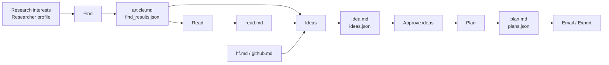
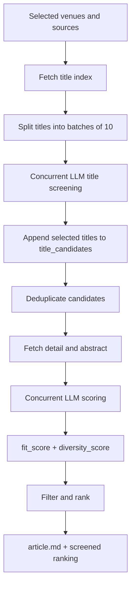
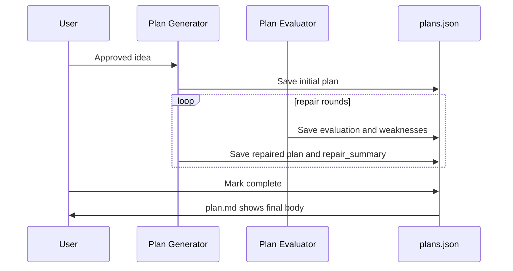

# TASTE: Targeted Academic Search, Triage & Exploration


**TASTE** 是一个本地运行的 AI Research Copilot。它根据你的研究兴趣和研究者画像，自动发现论文与相关开源资源，严格筛选候选论文，辅助精读，生成研究 idea，并把通过的 idea 发展成可执行的 research plan。

[English README](README.en.md)

默认本地地址：

```text
http://127.0.0.1:8765
```

## 目录

- [功能亮点](#功能亮点)
- [快速开始](#快速开始)
- [配置教程](#配置教程)
- [使用说明](#使用说明)
- [流水线](#流水线)
- [产物目录](#产物目录)
- [开发与测试](#开发与测试)
- [安全说明](#安全说明)
- [参考与致谢](#参考与致谢)
- [许可证](#许可证)

## 功能亮点

- **定向论文发现**：内置完整 CCF 会议/期刊目录，并补充 ICLR、OpenReview、DBLP、arXiv、Hugging Face、GitHub 等来源。
- **严格两阶段筛选**：先按标题批筛选，再抓摘要/详情做二次评分，输出 `fit_score`、`diversity_score` 和最终排名。
- **完整研究流水线**：Find -> Read -> Ideas -> Plan -> Email/export。
- **多角色 LLM 配置**：Find、Read、Idea Generator、Idea Judge、Plan Generator、Plan Evaluator 可分别指定模型。
- **本地优先**：所有 run 产物保存在本机，默认只监听 `127.0.0.1`。
- **开源安全默认值**：仓库不包含 API key、私人研究画像、运行历史、下载 PDF 或私有 reference 仓库。

## 快速开始

### Windows

```powershell
git clone <your-fork-or-repo-url> TASTE
cd TASTE
.\scripts\setup_windows.ps1
.\scripts\start_web.ps1
```

打开：

```text
http://127.0.0.1:8765
```

健康检查：

```powershell
Invoke-RestMethod http://127.0.0.1:8765/health
```

### Linux

```bash
git clone <your-fork-or-repo-url> TASTE
cd TASTE
bash scripts/setup_linux.sh
bash scripts/start_web.sh
```

### 手动启动后端

Windows：

```powershell
.\.venv\Scripts\python.exe -m uvicorn auto_research.web.server:app --host 127.0.0.1 --port 8765
```

Linux：

```bash
.venv/bin/python -m uvicorn auto_research.web.server:app --host 127.0.0.1 --port 8765
```

## 配置教程

TASTE 的本地配置文件是：

```text
../../runtime/auto_research/.config.json
```

该文件已被 `.gitignore` 忽略。你可以从安全示例开始：

```powershell
New-Item -ItemType Directory -Force ..\..\runtime\auto_research | Out-Null
Copy-Item ..\..\config.example.json ..\..\runtime\auto_research\.config.json
```

Linux：

```bash
mkdir -p ../../runtime/auto_research
cp ../../config.example.json ../../runtime/auto_research/.config.json
```

也可以直接在网页里填写配置，然后点击 **Save Config**。

### 研究画像

这两项会直接决定推荐质量：

| 字段 | 说明 |
| --- | --- |
| `research_interest` | 当前想追踪的研究方向，例如 AI for Science、材料发现、多模态推理、生成式模型。 |
| `researcher_profile` | 你的背景、偏好、可用资源、约束条件，以及不希望推荐的方向。 |

建议写清楚什么算“真正匹配”，什么只是“泛泛 AI 相关”。画像越具体，TASTE 的筛选越稳定。

### LLM 配置

TASTE 使用 OpenAI-compatible Chat Completions API。此配置只供 TASTE 自身的 Find/Read/Idea/Plan 使用；Claude Code 账号、API key、base URL 和默认模型必须由用户在自己的 Claude Code 环境中配置，TASTE 不会写入或覆盖。

| 字段 | 说明 |
| --- | --- |
| `provider` | 供应商标签，例如 `openai`、`openai-compatible`、`local`。 |
| `base_url` | API base URL，例如 `https://api.openai.com/v1`。 |
| `api_key` | 本地 API key，请勿提交到 Git。 |
| `model` | 模型名称。 |
| `temperature` | 采样温度，推荐 `0.2-0.6`。 |

可为这些角色单独覆盖 LLM：

- `find`
- `read`
- `idea_generator`
- `idea_judge`
- `plan_generator`
- `plan_evaluator`

角色字段留空时会继承全局 LLM 配置。

### 并发、数量和来源

| 字段 | 说明 |
| --- | --- |
| `llm_concurrency` | Find 阶段 LLM 并发数，推荐 `4-16`，最大 `32`。 |
| `idea_parallel_workers` | Idea 生成 worker 数，推荐 `1-8`。 |
| `max_fetch_papers` | 最多抓取论文数量。 |
| `max_recommended_papers` | 最终推荐论文最大数量。 |
| `max_ideas` | 最终推荐 idea 数量。 |
| `venue_title_scan_limit` | 会议标题抓取默认全量；`0` 表示不设数量上限，正数只用于测试或异常数据源保护。 |
| `arxiv_categories` | 支持多个分类，例如 `cs.AI, cs.CV, cs.CL`。 |
| `arxiv_start_date`, `arxiv_end_date` | 可选日期范围；两者都留空时 arXiv 默认抓取近半年。 |

### 邮件报告

TASTE 可以把 Markdown 产物渲染成 HTML 后发送邮件。

| 字段 | 说明 |
| --- | --- |
| `smtp_server` | SMTP 服务器。 |
| `smtp_port` | `465` 使用 SSL，其它端口优先 STARTTLS。 |
| `sender` | 发件邮箱。 |
| `receivers` | 收件人列表。 |
| `smtp_password` | SMTP 密码或应用专用密码，请勿提交到 Git。 |
| `auto_send_enabled` | 是否任务完成后自动发送，默认关闭。 |

## 使用说明

### 1. Find：发现与筛选论文

1. 填写研究兴趣和研究者画像。
2. 在会议列表中搜索并添加 venue。
3. 输入一个或多个年份，例如 `2024, 2025, 2026`。
4. 选择是否包含 arXiv、Hugging Face 和 GitHub。
5. 启动 Find，并在 job 面板查看进度。

Find 使用 append 式两阶段筛选：

```text
venues/arXiv/HF/GitHub
-> title index
-> 每 10 篇标题一批交给 LLM
-> append 到 title_candidates
-> 只对候选抓详情和摘要
-> LLM 二次评分
-> 排序推荐
```

最终推荐强调强契合度。泛泛 AI 相关但不命中画像的论文应得到较低 `fit_score`。

### 2. Read：精读论文

从 `article.md` 中选择论文，系统会尝试下载公开可访问 PDF，并生成 `read.md`。TASTE 不绕过付费墙。

### 3. Ideas：生成研究想法

系统会基于 `article.md`、`read.md`、`hf.md`、`github.md` 生成候选 idea，再由 judge LLM 打分筛选。用户可以编辑、通过或删除 idea。

### 4. Plan：生成研究计划

对已通过 idea 生成 research plan。流程如下：

```text
initial plan -> evaluate -> repair/polish -> evaluate -> repair/polish ...
```

每轮都会记录 evaluation、weaknesses、repair instructions 和 repair summary。点击完成后，`plan.md` 只展示最终正文，完整过程保存在 `plans.json`。

### 5. Email：发送报告

配置 SMTP 后，可以手动发送某个 run 的报告，也可以开启指定阶段完成后的自动发送。邮件正文是渲染后的 HTML。

## 流水线



### Find 两阶段筛选



### Plan 修复循环



## 产物目录

每次运行保存在：

```text
auto_research/runs/{run_id}/
```

常见产物：

```text
article.md
find_results.json
source_status.md
hf.md
github.md
read.md
read_results.json
idea.md
ideas.json
plan.md
plans.json
config.json
selection.json
manifest.json
email_report.json
```

最新 Markdown 也会同步到阶段目录，例如：

```text
auto_research/auto_find/article.md
auto_research/auto_read/read.md
auto_research/auto_idea/idea.md
auto_research/auto_plan/plan.md
```

这些生成文件可能包含私人研究上下文，请勿提交到 Git。

## 开发与测试

后端测试：

```bash
python -m pytest
```

前端构建：

```bash
cd auto_research/web/client
npm run build
```

API smoke test：

```bash
python scripts/smoke_api.py
```

## 安全说明

- 默认只监听 `127.0.0.1`。
- 不要提交 `../../runtime/auto_research/.config.json`。
- 不要提交 API key、SMTP password、私人研究画像、PDF 或 run 产物。
- run artifact 会隐藏 API key 和 SMTP password，但仍可能包含私人研究上下文。
- TASTE 只下载公开可访问 PDF，不绕过付费墙。

## 参考与致谢

本项目在设计和实现过程中参考了若干项目的思路与部分实现方式：

- **iDeer**：研究助手流程、信息源聚合、报告生成和邮件报告设计。
- **openccf**：CCF 目录结构、会议/期刊元数据组织和 DBLP 抓取策略；本仓库内置的 `auto_research/data/ccf_venues.json` 是基于 openccf 公开 CCF 数据整理出的归一化 venue catalog。
- **ICLR2026-Guide-CN**：OpenReview/ICLR 论文收集、组织和展示方式。
- **ccf-deadlines**：会议信息组织和用户侧 venue 工作流设计。

## 许可证

TASTE 使用 GNU Affero General Public License v3.0。详见 [LICENSE](LICENSE)。

